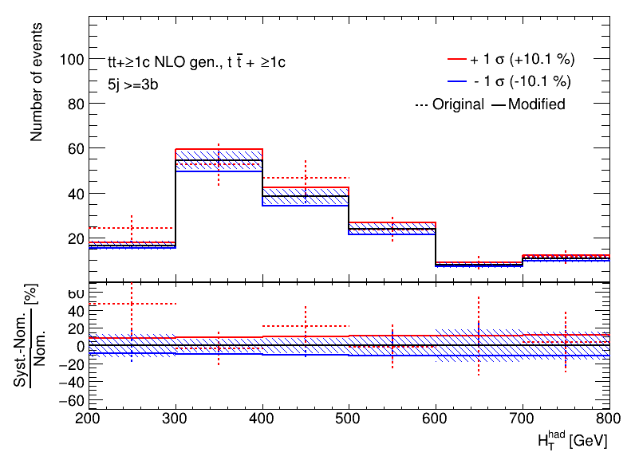
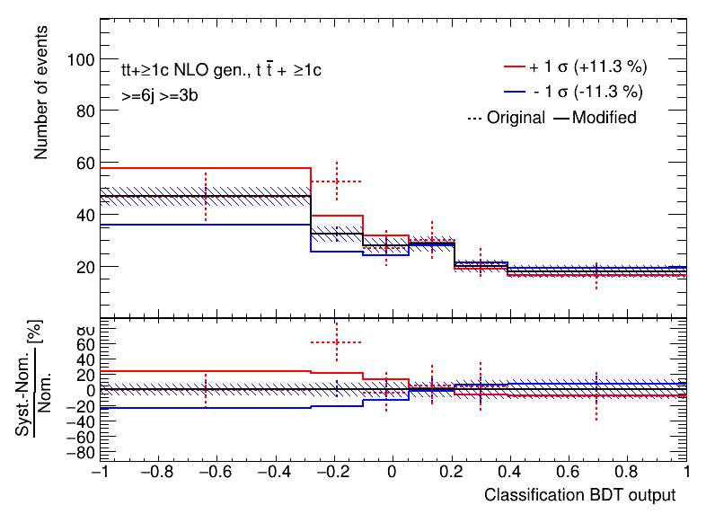
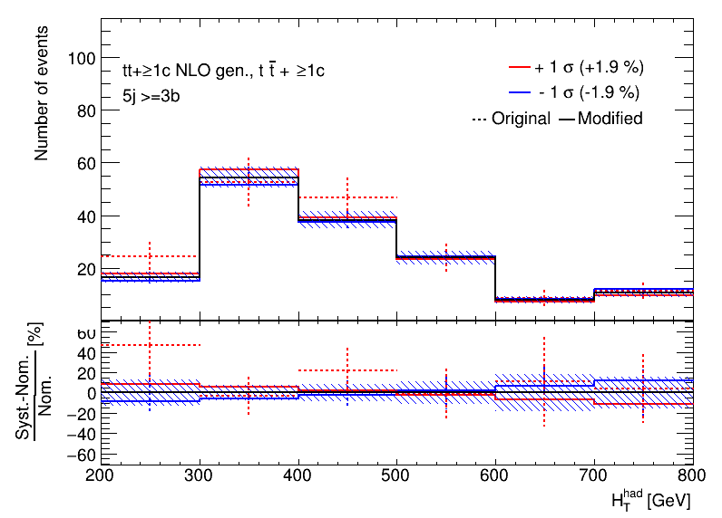
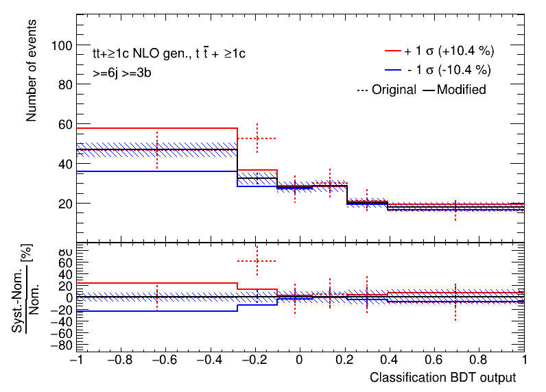
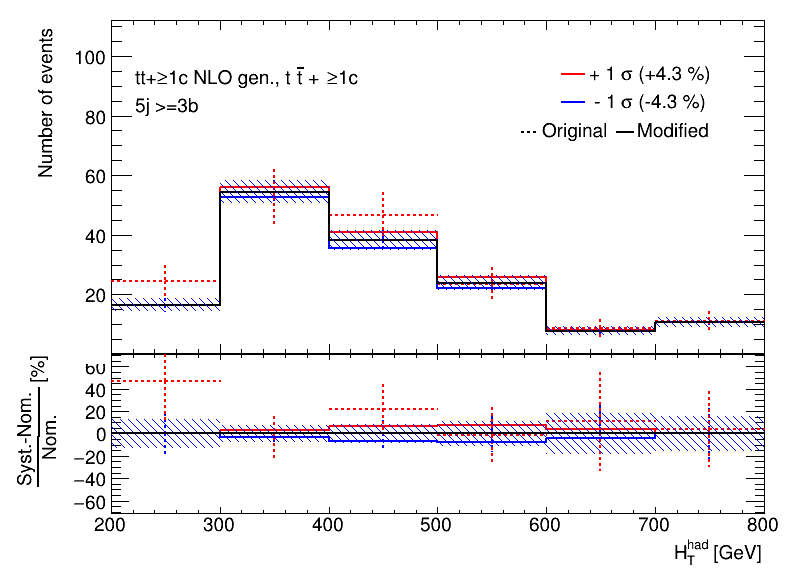
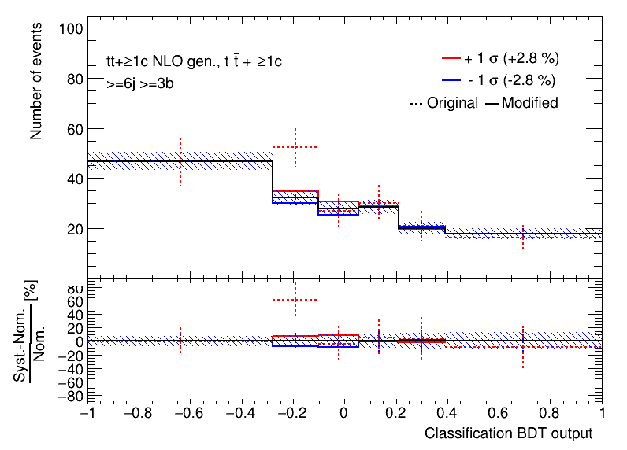

# Option to force a shape withing an error band by hand

## Introduction

It may sound a bit weird to modify a template for systematic uncertainty, which is exactly what will be discussed here.
However, for some systematic uncertainties this is a valid cross-check.
Some systematic uncertainties do not have a good statistical interpretation, like the famous 2-point systematics (e.g. Pythia vs Herwig).
The usual template just gives an error band rather than a well defined shift.
Thus, in these cases, the definition of the uncertainty is not clear a several shapes within the error band can be tested to see how the result relies on a given shape.

### Example

Let us first produce some systematic uncertainty (red-blue) plots using a config file for the CI tests.

```bash
trex-fitter n test/configs/FitExampleNtuple.config
```

Now, focus on one particular uncertainty, `ttc_Gen`. You should see the plots below.
 



Focus on the shape of the up and down uncertainty.
Now modify the config file by adding the following line `ForceShape: LINEAR` to the `Systematic: "ttc_Gen"` block.
The option changes the original sjhape by doing linear interpolation from the leftmost up variation to the rightmost down variation.

Rerun the production of the histograms, using the `b` step (so you dont have to redo the `n` step) 

```bash
trex-fitter b test/configs/FitExampleNtuple.config
```

You should now see different variations but still within the error band defined by the different betweent he original and the varied template

!!! hint "This is a replacement of the uncertainty"
    Note that the original uncertainty is _replaced_.




Other supported option is the `TRIANGULAR` setting, which will set the shape to be zero at the rightmost and leftmost part, and will reach the rror band in the middle.





